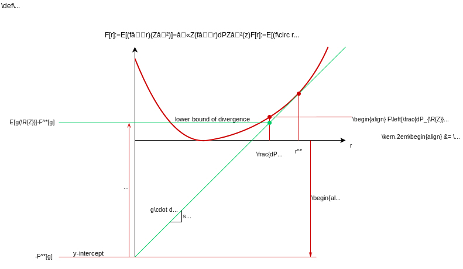

---
jupytext:
  formats: ipynb,md:myst
  text_representation:
    extension: .md
    format_name: myst
    format_version: 0.13
    jupytext_version: 1.11.4
kernelspec:
  display_name: Python 3.8 (XPython)
  language: python
  name: xpython
---

# Mutual Information Estimation

+++

$\def\abs#1{\left\lvert #1 \right\rvert}
\def\Set#1{\left\{ #1 \right\}}
\def\mc#1{\mathcal{#1}}
\def\M#1{\boldsymbol{#1}}
\def\R#1{\mathsf{#1}}
\def\RM#1{\boldsymbol{\mathsf{#1}}}
\def\op#1{\operatorname{#1}}
\def\E{\op{E}}
\def\d{\mathrm{\mathstrut d}}
$

+++

## Formulation

+++

The problem of estimating the mutual information is:

+++

```{prf:definition}
:label: MI-estimation

Given *i.i.d. samples* 
$(\R{X}_1,\R{Y}_1),\dots, (\R{X}_n,\R{Y}_n)$ drawn from an *unknown* probability measure $P_{\R{X},\R{Y}}\in \mc{P}(\mc{X},\mc{Y})$, estimate the *mutual information*

$$
\begin{align}
I(\R{X}\wedge\R{Y}) &:= E\left[\log \frac{d P_{\R{X},\R{Y}}(\R{X},\R{Y})}{d (P_{\R{X}}(\R{X}) \times P_{\R{Y}}(\R{Y}))} \right].
\end{align}
$$ (MI)
```

+++

---
Given *i.i.d. samples* 
$(\R{X}_1,\R{Y}_1),\dots, (\R{X}_n,\R{Y}_n)$ drawn from an *unknown* probability measure $P_{\R{X},\R{Y}}\in \mc{P}(\mc{X},\mc{Y})$, estimate the *mutual information*
$$
\begin{align}
I(\R{X}\wedge\R{Y}) &:= E\left[\log \frac{d P_{\R{X},\R{Y}}(\R{X},\R{Y})}{d (P_{\R{X}}(\R{X}) \times P_{\R{Y}}(\R{Y}))} \right].
\end{align}
$$ (MI)

---

+++

This can be viewed as an estimation of the KL divergence:

+++

---
Given the sequences
$\R{Z}^n:=(\R{Z}_1,\dots, \R{Z}_n)$ and $\R{Z}'^{n'}$ of samples i.i.d. drawn from the unknown probability measures $P_{\R{Z}}$ and $P_{\R{Z}'}$ in $\mc{P}(\mc{Z})$ respectively, estimate the *divergence*

$$
\begin{align}
D(P_{\R{Z}}\|P_{\R{Z}'}) &:= E\left[\log \frac{d P_{\R{Z}}(\R{Z})}{d P_{\R{Z}'}(\R{Z})} \right].
\end{align}
$$ (D)

---

+++

{eq}`MI` is obtained from {eq}`D` with 
$$
\begin{align}
P_{\R{Z}} &= P_{\R{X}, \R{Y}}\\
P_{\R{Z}'} &= P_{\R{X}}\times P_{\R{Y}}.
\end{align}
$$

+++

Note that, as the dependency between $\R{Z}$ and $\R{Z}'$ does not affect the divergence, $n$ and $n'$ need not be the same.

+++

Indeed, to apply a divergence estimate to a mutual information estimate, one needs to approximate the i.i.d. sampling of $P_{\R{X}}\times P_{\R{Y}}$ using samples of $P_{\R{X}\R{Y}}$. This is often done by the re-sampling trick 
$$
\begin{align}
\R{Z}'^{n'} &=((\R{X}_{\R{J}_1},\R{Y}_{\R{K}_1})\mid i \in [n'])
\end{align}
$$
where $\R{J}_i$ and $\R{K}_i$ for $i\in [n']$ are (nearly) independent and uniformly random indices taking values from $[n]:=\Set{1,\dots,n}$.

+++

Regarding the mutual information as a divergence, the problem can be further generalized to estimtating other divergence measures such as the $f$-divergence:

+++

---
Given the sequences
$\R{Z}^n$ and $\R{Z}'^{n'}$ of i.i.d. samples drawn from the unknown probability measures $P_{\R{Z}}$ and $P_{\R{Z}'}$ in $\mc{P}(\mc{Z})$ respectively, estimate the *f-divergence*

$$
\begin{align}
D_f(P_{\R{Z}}\|P_{\R{Z}'}) &:= E\left[ f\left(\frac{d P_{\R{Z}}(\R{Z}')}{d P_{\R{Z}'}(\R{Z}')}\right). \right]
\end{align}
$$ (f-D)

for a strictly convex function $f$ with $f(1)=0$.

---

+++

$f$-divergence in {eq}`f-D` reduces to KL divergence when $f=u \log u$:
$$
\begin{align}
E\left[ \frac{d P_{\R{Z}}(\R{Z}')}{d P_{\R{Z}'}(\R{Z}')} \log \frac{d P_{\R{Z}}(\R{Z}')}{d P_{\R{Z}'}(\R{Z}')}  \right] &= \int_{\mc{Z}} \color{gray}{d P_{\R{Z}'}(z)} \cdot \frac{d P_{\R{Z}}(z)}{\color{gray}{d P_{\R{Z}'}(z)}} \log \frac{d P_{\R{Z}}(z)}{d P_{\R{Z}'}(z)}. 
\end{align}
$$

+++

It is a valid divergence because, by Jensen's inequality,
$$
D_f(P_{\R{Z}}\|P_{\R{Z}'}) \geq  f\bigg( \underbrace{E\left[ \frac{d P_{\R{Z}}(\R{Z}')}{d P_{\R{Z}'}(\R{Z}')} \right]}_{=1}\bigg) = 0
$$
with equality iff $P_{\R{Z}}=P_{\R{Z}'}$.

+++

Regarding the divergence as an expectation, it is approximated by the sample average:
$$
\begin{align}
D_f(P_{\R{Z}}\|P_{\R{Z}'}) &\approx 
\frac1n \sum_{i\in [n]} f\left(\frac{d P_{\R{Z}}(\R{Z}'_i)}{d P_{\R{Z}'}(\R{Z}'_i)}\right).
\end{align}
$$ (avg-f-D)

+++

However, this is not a valid estimate because it uses the unknown measures $P_{\R{Z}}$ and $P_{\R{Z}'}$ directly.

+++

---
Given the sequences
$\R{Z}^n$ and $\R{Z}'^{n'}$ of i.i.d. samples drawn from the unknown probability measures $P_{\R{Z}}$ and $P_{\R{Z}'}$ in $\mc{P}(\mc{Z})$ respectively, estimate the *(probabilistic) discriminator*

$$
\begin{align}
z \mapsto \frac{d P_{\R{Z}}(z)}{d P_{\R{Z}'}(z)}.
\end{align}
$$ (dP-ratio)

---

+++

Finally, one can apply the solution to the more general problem of estimating an unknown probability measure $P_{\R{Z}}$:

+++

---

Given i.i.d. samples $\R{Z}^n$ drawn from the unknown probability measure $P_{\R{Z}}\in \mc{P}(\mc{Z})$, estimate the pdf/pmf $p_{\R{Z}}(z)=\frac{dP_{\R{Z}}(z)}{dz}$. 

---

+++

Estimating the divergence well neither require nor imply the probability measure to be estimated well. However, the divergence estimate can be used as an objective to train a neural network to return the probability estimates. Indeed, the divergence estimate is often not the end goal. What can be more valuable are the features/representations learned by the neural network and applicable to different downstream inference tasks.

+++

## Neural estimation of KL divergence

+++

Consider estimtating the KL divergence first. The idea of neural estimation can be explained with the following variational formula for KL divergence equivalent to the Donsker-Varadhan (DV) formula {cite}`donsker1983asymptotic`.

+++

---
**Proposition**

$$
\begin{align}
D(P_{\R{Z}}\|P_{\R{Z}'}) & =  \sup_{\substack{r:\mc{Z}\to \mathbb{R}_+\\ E[r(\R{Z}')]=1}} E \left[ \log r(\R{Z}) \right] 
\end{align}
$$ (D1)

where the optimal $r$ satisfies

$$
\begin{align}
r(\R{Z}) = \frac{dP_{\R{Z}}(\R{Z})}{dP_{\R{Z}'}(\R{Z})}
\end{align}
$$ (D1:sol)

almost surely.

---

+++

It is easy to check that the optimal solution {eq}`D1:sol` satisfies the constraint in the supremum {eq}`D1` and gives the KL divergence {eq}`D` as desired. The proposition states further that $E[\log r(\R{Z})]$ for any feasible discriminator $r$ is a lower bound on the divergence.

+++

---
**Proof**
 
$$
\begin{align*}
D(P_{\R{Z}}\|P_{\R{Z}'})  &= D(P_{\R{Z}}\|P_{\R{Z}'}) - \inf_{Q\in \mc{P}(\mc{Z})} \underbrace{D(P_{\R{Z}}\|Q)}_{\geq 0 \text{ with equality iff } Q=P_{\R{Z}}\kern-3em} \\
&= \sup_{Q\in \mc{P}(\mc{Z})}  \underbrace{D(P_{\R{Z}}\|P_{\R{Z}'})}_{=E \left[\frac{dP_{\R{Z}}(\R{Z})}{dP_{\R{Z}'}(\R{Z})}\right]} -  \underbrace{D(P_{\R{Z}}\|Q)}_{=E \left[\frac{dP_{\R{Z}}(\R{Z})}{dQ(\R{Z})}\right]}\\
&= \sup_{Q\in \mc{P}(\mc{Z})} E \left[\frac{dQ(\R{Z})}{dP_{\R{Z}'}(\R{Z})}\right]
\end{align*}
$$

which gives {eq}`D1` by a change of variable $r(z) = \frac{dQ(z)}{dP_{\R{Z}'}(z)}$. 

The constraint on $r$ is obtained from the constraint on $Q\in \mc{P}(\mc{Z})$, i.e., with $dQ(z)=r(z)dP_{\R{Z}'}(z)$, 

$$
\begin{align*}
dQ(z) \geq 0 &\iff r(z)\geq 0\\
\int_{\mc{Z}}dQ(z)=1 &\iff E[r(\R{Z}')]=1.
\end{align*}
$$

{eq}`D1:sol` is from the additional optimality condition $Q=P_{\R{Z}}$ that

$$
dQ(z) = dP_{\R{Z}}(z) \iff r(z)  = \frac{dP_{\R{Z}}(z)}{dP_{\R{Z}'}(z)}.
$$

---

+++

The idea of neural estimation is to use the sample average {eq}`avg-f-D` to estimate the divergence. Since the discriminator {eq}`dP:ratio` is not know, a neural network can be trained to approximate the discriminator by gradient descent on the lower bound of the divergence.

+++

$$
\begin{align}
D(P_{\R{Z}}\|P_{\R{Z}'}) \approx \sup_{\substack{r:\mc{Z}\to \mathbb{R}_+\\ \frac1{n'}\sum_{i\in [n']} r(\R{Z}'_i)]=1}} \frac1n \sum_{i\in [n]} \log r(\R{Z})
\end{align}
$$ (avg-D1)

+++

Two questions remain: 

1) How to impose the constraint on $r$ when training a neural network? 
2) How accurate is the approximation, e.g, does the equality hold as $n\to \infty$?

+++

The first question can be addressed by a simple change of variable

$$
\begin{align}
r(z)&=\frac{e^{g(z)}}{E[e^{g(\R{Z}')}]}
\end{align}
$$ (r->g)

which satisfies the constraint automatically for any function $g:\mc{Z}\to \mathbb{R}$. Substituting {eq}`r->g` gives the well-known Donsker-Varadhan formula:

+++

---
**Corollary** [{cite}`donsker1983asymptotic`]

$$
\begin{align}
D(P_{\R{Z}}\|P_{\R{Z}'}) =  \sup_{g: \mc{Z} \to \mathbb{R}} E[g(Z)] - \log E[e^{g(Z')}]
\end{align}
$$ (DV)

where the optimal $g$ satisfies
$$
\begin{align}
g(\R{Z}) = \log \frac{dP_{\R{Z}}(\R{Z})}{dP_{\R{Z}'}(\R{Z})} + c
\end{align}
$$ (DV:sol)

almost surely for some constant $c$.

---

+++

Note that $g$ 

+++

The *mutual information neural estimation (MINE)* in {cite}`belghazi2018mine` uses the Donsker-Varadhan formula for the KL divergence: 

+++

$$
\begin{align}
I(\R{X}\wedge \R{Y}) &= D(P_{\R{X},\R{Y}}\|P_{\R{X}}\times P_{\R{Y}}) \\
&=  \sup_{g: \mc{X}\times \mc{Y} \to \mathbb{R}} E[g(\R{X},\R{Y})] - \log E[e^{g(\R{X}', \R{Y}')}]\\
&\approx \sup_{\theta} \frac1n \sum_{i\in [n]} g_{\theta}(\R{X}_i,\R{Y}_i)] - \log \frac1{n'} \sum_{i\in [n']}e^{g_{\theta}(\R{X}_{\R{J}_i}, \R{Y}_{\R{K}_i})}.
\end{align}
$$ (MINE)

where $P_{\R{X}',\R{Y}'}:=P_{\R{X}}\times P_{\R{Y}}$ and $g_{\theta}$ is a neural network with parameter $\theta$.

+++

The mutual information between two random variables is defined as
$$
\begin{align}
I(\R{X}\wedge \R{Y}) &= D(P_{\R{X},\R{Y}}\|P_{\R{X}},P_{\R{Y}})\\
&= D(P_{\R{Y}|\R{X}}\|P_{\R{Y}}|P_{\R{X}})
\end{align}
$$

```{code-cell}

```

To estimate mutual information using a neural network, 

+++

**Proposition** 

For two random variables $\R{Z}$ and $\R{Z}'$, the Donsker Varadhan formula for divergence is

$$
\begin{align}
D(P_{\R{Z}} \| P_{\R{Z}'}) &= \sup_{g\in \mathcal{G}} E[g(Z)] - \log E[e^{g(Z')}]
\end{align}
$$ (VD)

where $\mathcal{G}$ is the set of function $g:\mc{Z}\to \mathbb{R}$. The optimal solution satisfies

$$
\begin{align}
g(\R{Z}') \stackrel{a.s.}{=} \log \frac{d P_{\R{Z}}}{ d P_{\R{Z}'}} + c
\end{align}
$$ (VD_sol)

for some constant $c$. The random variables can be discrete, continuous, or a mixture of both.

+++

A simple proof follows from the positivity of divergence.

+++

$$
\begin{align}
H(\R{Z}) &= \inf_{Q \in \mc{P}(\mc{Z})} E\left[ -\log q(\R{Z}) \right]\\
&= \inf_{t:\mc{Z}\to \mathbb{R}} E\left[ -\log \frac{e^{t(\R{Z})}}{E[e^{t(\R{Z}')}/p_{\R{Z}'}(\R{Z}')]} \right]\\
\end{align}
$$
where the last expressing is obtained by rewriting 
$q(\cdot):=\frac{e^{t(\cdot)}}{c}$ using the exponent $t$ with the normalization factor $c$ given by
$$
\begin{align}
E[e^{t(\R{Z}')}/P_{\R{Z}'(\R{Z}')}] &= \int_{\mc{Z}} \frac{e^{t(\R{Z}')}}{p_{\R{Z}'}(\R{Z}')} p_{\R{Z}'}(\R{Z}') dz\\
&=  \int_{\mc{Z}} e^{t(\R{Z}')}dz.
\end{align}
$$

+++

$$
\begin{align}
D(P_{\R{Z}}\|P_{\R{Z}'}) &= E\left[-\log p_{\R{Z}'}(\R{Z})\right] - H(\R{Z})\\
&=  \sup_{t:\mc{Z}\to \mathbb{R}} E\left[ -\log \frac{e^{t(\R{Z})}/p_{\R{Z}'}(\R{Z}')}{E[e^{t(\R{Z}')}/p_{\R{Z}'}(\R{Z}')]} \right]\\
&= \sup_{t:\mc{Z}\to \mathbb{R}} E\left[ -\log \frac{e^{f(\R{Z})}}{E[e^{f(\R{Z}')}]} \right]
\end{align}
$$
where the last equality is obtained with $f:=t-\log p_{\R{Z}'}$.

+++

The optimal solution satisfies 

$$
t(\R{Z}) \stackrel{a.s.}{=} \log p_{\R{Z}}(\R{Z}) + \log c
$$
for some constant $c$.

The optimal solut

+++



```{code-cell}
from IPython import display 
```

```{code-cell}
display.HTML(filename='f-D.html')
```

```{code-cell}
display.IFrame(src="f-D.html", width="845", height="415")
```

```{code-cell}

```
