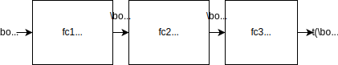
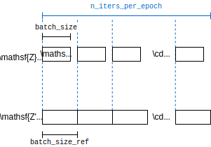

---
jupytext:
  formats: ipynb,md:myst
  text_representation:
    extension: .md
    format_name: myst
    format_version: 0.13
    jupytext_version: 1.11.4
kernelspec:
  display_name: Python 3 (ipykernel)
  language: python
  name: python3
---

+++ {"slideshow": {"slide_type": "slide"}}

# Mutual Information Estimation

+++

$\def\abs#1{\left\lvert #1 \right\rvert}
\def\Set#1{\left\{ #1 \right\}}
\def\mc#1{\mathcal{#1}}
\def\M#1{\boldsymbol{#1}}
\def\R#1{\mathsf{#1}}
\def\RM#1{\boldsymbol{\mathsf{#1}}}
\def\op#1{\operatorname{#1}}
\def\E{\op{E}}
\def\d{\mathrm{\mathstrut d}}$

```{code-cell} ipython3
import ipywidgets as widgets
import matplotlib.pyplot as plt
import numpy as np
import pandas as pd
import seaborn as sns
import torch
import torch.optim as optim
from IPython import display
from torch import Tensor, nn
from torch.nn import functional as F
from torch.utils.tensorboard import SummaryWriter

%load_ext tensorboard
%matplotlib inline
SEED = 0
```

+++ {"slideshow": {"slide_type": "slide"}}

## Problem formulations

+++

**How to formulate the problem of mutual information estimation?**

+++ {"slideshow": {"slide_type": "subslide"}}

The problem of estimating the mutual information is:

+++ {"slideshow": {"slide_type": "-"}}

---
Given $n$ samples

$$(\R{X}_1,\R{Y}_1),\dots, (\R{X}_n,\R{Y}_n) \stackrel{iid}{\sim} P_{\R{X},\R{Y}}\in \mc{P}(\mc{X},\mc{Y})$$ 

i.i.d. drawn from an *unknown* probability measure $P_{\R{X},\R{Y}}$ from the space $\mc{X}\times \mc{Y}$, estimate the *mutual information (MI)*

$$
\begin{align}
I(\R{X}\wedge\R{Y}) &:= E\left[\log \frac{d P_{\R{X},\R{Y}}(\R{X},\R{Y})}{d (P_{\R{X}} \times P_{\R{Y}})(\R{X},\R{Y})} \right].
\end{align}
$$ (MI)

---

+++

Run the following code, which uses `numpy` to 
- generate i.i.d. samples from a multivariate gaussian distribution, and
- store the samples as numpy arrays assigned to `XY`.

```{code-cell} ipython3
import numpy as np

# Seeded random number generator for reproducibility
XY_rng = np.random.default_rng(SEED)

# Sampling from an unknown probability measure
rho = 1 - 0.19 * XY_rng.random()
mean, cov, n = [0, 0], [[1, rho], [rho, 1]], 1000
XY = XY_rng.multivariate_normal(mean, cov, n)
plt.scatter(XY[:, 0], XY[:, 1], s=2)
```

You may find more details below:
- https://numpy.org/doc/stable/reference/random/generated/numpy.random.multivariate_normal.html
- https://matplotlib.org/stable/api/_as_gen/matplotlib.pyplot.scatter.html

+++

---

**Tips**

To learn about a python object in JupyterLab:

- **Docstring**: 
  - Move the cursor to the object and 
    - click `Help->Show Contextual Help` or
    - click `Shift-Tab` if you have limited screen space.
- **Directory/Source**:
  - Right click on a notebook and choose `New Console for Notebook`. 
  - Run `dir(obj)` for a previously defined object `obj` To see the available methods/properties of `obj`.
  - Run `obj??` to print the source code defining `obj`, if available.

---

+++

---

**Exercise** What is unknown about the above sampling distribution?

+++ {"tags": ["hide-cell"]}

The density is

$$
\frac{d P_{\R{X},\R{Y}}}{dxdy} = \mc{N}_{\M{0},\left[\begin{smallmatrix}1 & \rho \\ \rho & 1\end{smallmatrix}\right]}(x,y)
$$

but $\rho$ is unknown (uniformly random over $[0.8,0.99)$).

+++

---

+++

To show the data samples using `pandas`:

```{code-cell} ipython3
---
slideshow:
  slide_type: fragment
tags: []
---
import pandas as pd

XY_df = pd.DataFrame(XY, columns=["X", "Y"])
XY_df
```

To plot the data using `seaborn`:

```{code-cell} ipython3
def plot_samples_with_kde(df, **kwargs):
    p = sns.PairGrid(df, **kwargs)
    p.map_lower(sns.scatterplot, s=2)  # scatter plot of samples
    p.map_upper(sns.kdeplot)  # kernel density estimate for pXY
    p.map_diag(sns.kdeplot)  # kde for pX and pY
    return p


plot_samples_with_kde(XY_df)
plt.show()
```

**Exercise** Complete the following code by replacing the blanks `___` so that `XY_ref` stores the i.i.d. samples of $(\R{X}',\R{Y}')$ where $\R{X}'$ and $\R{Y}'$ are zero-mean independent gaussian random variables with unit variance.

+++

```Python
...
cov_ref, n_ = ___, n
XY_ref = XY_ref_rng_ref.___(mean, ___, n_)
...
```

```{code-cell} ipython3
XY_ref_rng = np.random.default_rng(SEED)
### BEGIN SOLUTION
cov_ref, n_ = [[1, 0], [0, 1]], n
XY_ref = XY_ref_rng.multivariate_normal(mean, cov_ref, n_)
### END SOLUTION
XY_ref_df = pd.DataFrame(XY_ref, columns=["X", "Y"])
plot_samples_with_kde(XY_ref_df)
plt.show()
```

**Can we generalize the problem further?**

+++ {"slideshow": {"slide_type": "subslide"}, "tags": []}

Estimating MI may be viewed as a special case of the following problem:

+++ {"slideshow": {"slide_type": "-"}}

---

Estimate the KL *divergence*

$$
\begin{align}
D(P_{\R{Z}}\|P_{\R{Z}'}) &:= E\left[\log \frac{d P_{\R{Z}}(\R{Z})}{d P_{\R{Z}'}(\R{Z})} \right]
\end{align}
$$ (D)

using 
- a sequence $\R{Z}^n:=(\R{Z}_1,\dots, \R{Z}_n)\sim P_{\R{Z}}^n$ of i.i.d. samples from $P_{\R{Z}}$ if $P_{\R{Z}}$ is unknown, and
- another sequence ${\R{Z}'}^{n'}\sim P_{\R{Z}'}^{n'}$ of i.i.d. samples from $P_{\R{Z}'}$  if $P_{\R{Z}'}$, the *reference measure* of $P_{\R{Z}}$, is also unknown.

---

+++ {"slideshow": {"slide_type": "fragment"}, "tags": []}

---
**Exercise** 

Although $\R{X}^n$ and $\R{Y}^n$ for MI estimation should have the same length, $\R{Z}^n$ and ${\R{Z}'}^{n'}$ can have different lengths, i.e., $n \not\equiv n'$. Why?

+++ {"tags": ["hide-cell"], "slideshow": {"slide_type": "fragment"}}

**Solution** The dependency between $\R{Z}$ and $\R{Z}'$ does not affect the divergence.

+++

---

+++ {"slideshow": {"slide_type": "subslide"}, "tags": []}

Regarding the mutual information as a divergence from joint to product distributions, the problem can be further generalized to estimtate other divergences such as the $f$-divergence:

+++

For a strictly convex function $f$ with $f(1)=0$,

$$
\begin{align}
D_f(P_{\R{Z}}\|P_{\R{Z}'}) &:= E\left[ f\left(\frac{d P_{\R{Z}}(\R{Z}')}{d P_{\R{Z}'}(\R{Z}')}\right) \right].
\end{align}
$$ (f-D)

+++

$f$-divergence in {eq}`f-D` reduces to KL divergence when $f=u \log u$:

$$
\begin{align}
E\left[ \frac{d P_{\R{Z}}(\R{Z}')}{d P_{\R{Z}'}(\R{Z}')} \log \frac{d P_{\R{Z}}(\R{Z}')}{d P_{\R{Z}'}(\R{Z}')}  \right] &= \int_{\mc{Z}} \color{gray}{d P_{\R{Z}'}(z)} \cdot \frac{d P_{\R{Z}}(z)}{\color{gray}{d P_{\R{Z}'}(z)}} \log \frac{d P_{\R{Z}}(z)}{d P_{\R{Z}'}(z)}. 
\end{align}
$$

+++

---

**Exercise**

Show that $D_f(P_{\R{Z}}\|P_{\R{Z}'})\geq 0$ with equality iff $P_{\R{Z}}=P_{\R{Z}'}$ using Jensen's inequality and the properties of $f$.

+++

**Solution**

It is a valid divergence because, by Jensen's inequality,

$$
D_f(P_{\R{Z}}\|P_{\R{Z}'}) \geq  f\bigg( \underbrace{E\left[ \frac{d P_{\R{Z}}(\R{Z}')}{d P_{\R{Z}'}(\R{Z}')} \right]}_{=1}\bigg) = 0
$$

with equality iff $P_{\R{Z}}=P_{\R{Z}'}$.

+++

---

+++

Regarding the divergence as an expectation, it is approximated by the sample average:

$$
\begin{align}
D_f(P_{\R{Z}}\|P_{\R{Z}'}) &\approx 
\frac1n \sum_{i\in [n]} f\left(\frac{d P_{\R{Z}}(\R{Z}'_i)}{d P_{\R{Z}'}(\R{Z}'_i)}\right).
\end{align}
$$ (avg-f-D)

+++

However, this is not a valid estimate because it involves the unknown measures $P_{\R{Z}}$ and $P_{\R{Z}'}$.

+++

One may further estimate the *density ratio*

$$
\begin{align}
z \mapsto \frac{d P_{\R{Z}}(z)}{d P_{\R{Z}'}(z)}
\end{align}
$$ (dP-ratio)

+++

or estimate the density defined respective to some reference measure $\mu$:

$$
\begin{align}
p_{\R{Z}}&:=\frac{dP_{\R{Z}}}{d\mu} \in \mc{P}_{\mu}(\mc{Z}).
\end{align}
$$ (density)

+++

## Neural estimation of KL divergence

+++

Estimating MI well neither require nor imply the divergence/density to be estimated well. However, 
- MI estimation is often not the end goal, but an objective to train a neural network to return the divergence/density. 
- The features/representations learned by the neural network may be applicable to different downstream inference tasks.

+++

To explain the idea of neural estimation, consider the following characterization of divergence:

+++

---
**Proposition**

$$
\begin{align}
D(P_{\R{Z}}\|P_{\R{Z}'}) & =  \sup_{Q\in \mc{P}(\mc{Z})} E \left[ \log \frac{dQ(\R{Z})}{dP_{\R{Z}'}(\R{Z})} \right] 
\end{align}
$$ (D1)

where the unique optimal solution is $Q=P_{\R{Z}}$.

---

+++

{eq}`D1` is {eq}`D` but with $P_{\R{Z}}$ replaced by a parameter $Q$.

- The proposition essentially gives a tight lower bound on KL divergence.
- The unknown distribution is recovered as the optimal solution.

+++

---

**Proof**

To prove {eq}`D1`,

$$
\begin{align*}
D(P_{\R{Z}}\|P_{\R{Z}'})  &= D(P_{\R{Z}}\|P_{\R{Z}'}) - \inf_{Q\in \mc{P}(\mc{Z})} \underbrace{D(P_{\R{Z}}\|Q)}_{\geq 0 \text{ with equality iff } Q=P_{\R{Z}}\kern-3em} \\
&= \sup_{Q\in \mc{P}(\mc{Z})}  \underbrace{D(P_{\R{Z}}\|P_{\R{Z}'})}_{=E \left[\frac{dP_{\R{Z}}(\R{Z})}{dP_{\R{Z}'}(\R{Z})}\right]} -  \underbrace{D(P_{\R{Z}}\|Q)}_{=E \left[\frac{dP_{\R{Z}}(\R{Z})}{dQ(\R{Z})}\right]}\\
&= \sup_{Q\in \mc{P}(\mc{Z})} E \left[\frac{dQ(\R{Z})}{dP_{\R{Z}'}(\R{Z})}\right]
\end{align*}
$$

---

+++

The idea of neural estimation is to 

- estimate the expectation in {eq}`D1` by the sample average  

$$
\frac1n \sum_{i\in [n]} \log \underbrace{\frac{dQ(\R{Z}_i)}{dP_{\R{Z}'}(\R{Z}_i)}}_{\text{(*)}},
$$

+++

- use a neural network to compute the density ratio (*), and train the network to maximizes the expectation, e.g., by gradient ascent on the above sample average.

+++

Since $Q$ is arbitrary, the sample average above is a valid estimate.

+++

**But how to compute the density ratio?**

+++

We will first consider estimating the KL divergence $D(P_{\R{Z}}\|P_{\R{Z}'})$ when both $P_{\R{Z}}$ and $P_{\R{Z}'}$ are unknown.

+++

If $P_{\R{Z}'}$ is unknown, we can apply a change of variable

+++

$$
r(z) = \frac{dQ(z)}{dP_{\R{Z}'}(z)},
$$ (Q->r)

+++

which absorbs the unknown reference into the parameter.

+++

---
**Proposition**

$$
\begin{align}
D(P_{\R{Z}}\|P_{\R{Z}'}) & =  \sup_{\substack{r:\mc{Z}\to \mathbb{R}_+\\ E[r(\R{Z}')]=1}} E \left[ \log r(\R{Z}) \right] 
\end{align}
$$ (D1)

where the optimal $r$ satisfies 
$
r(\R{Z}) = \frac{dP_{\R{Z}}(\R{Z})}{dP_{\R{Z}'}(\R{Z})}.
$ 

---

+++

---

**Exercise** Show using {eq}`Q->r` that the optimal solution satisfies the constraint stated in the supremum {eq}`D1`.

+++

The constraint on $r$ is obtained from the constraint on $Q\in \mc{P}(\mc{Z})$, i.e., with $dQ(z)=r(z)dP_{\R{Z}'}(z)$, 

$$
\begin{align*}
dQ(z) \geq 0 &\iff r(z)\geq 0\\
\int_{\mc{Z}}dQ(z)=1 &\iff E[r(\R{Z}')]=1.
\end{align*}
$$

+++

---

+++

The next step is to train a neural network that computes $r$. What about?

+++

$$
\begin{align}
D(P_{\R{Z}}\|P_{\R{Z}'}) \approx \sup_{\substack{r:\mc{Z}\to \mathbb{R}_+\\ \frac1{n'}\sum_{i\in [n']} r(\R{Z}'_i)]=1}} \frac1n \sum_{i\in [n]} \log r(\R{Z}_i)
\end{align}
$$ (avg-D1)

+++

**How to impose the constraint on $r$ when training a neural network?**

+++

We can apply by a change of variable:

$$
\begin{align}
r(z)&=\frac{e^{t(z)}}{E[e^{t(\R{Z}')}]}.
\end{align}
$$ (r->t)

+++

**Exercise** Show that $r$ defined in {eq}`r->t` satisfies the constraint in {eq}`D1` for all real-valued function $t:\mc{Z}\to \mathbb{R}$.

+++

**Proof** 

$$
\begin{align}
E\left[ \frac{e^{t(\R{Z}')}}{E[e^{t(\R{Z}')}]} \right] =  \frac{E\left[ e^{t(\R{Z}')} \right]}{E[e^{t(\R{Z}')}]} = 1.
\end{align}
$$

+++

Substituting {eq}`r->t` into {eq}`D1` gives the well-known *Donsker-Varadhan (DV)* formula:

+++

---
**Corollary** [{cite}`donsker1983asymptotic`]

$$
\begin{align}
D(P_{\R{Z}}\|P_{\R{Z}'}) =  \sup_{t: \mc{Z} \to \mathbb{R}} E[t(\R{Z})] - \log E[e^{t(\R{Z}')}]
\end{align}
$$ (DV)

where the optimal $t$ satisfies
$$
\begin{align}
t(\R{Z}) = \log \frac{dP_{\R{Z}}(\R{Z})}{dP_{\R{Z}'}(\R{Z})} + c
\end{align}
$$ (DV:sol)

almost surely for some constant $c$.

---

+++

The divergence can be estimated as follows instead of {eq}`avg-D1`:

+++

$$
\begin{align}
D(P_{\R{Z}}\|P_{\R{Z}'}) \approx \sup_{t: \mc{Z} \to \mathbb{R}} \frac1n \sum_{i\in [n]} t(\R{Z}_i) - \frac1{n'}\sum_{i\in [n']} e^{t(\R{Z}'_i)}
\end{align}
$$ (avg-DV)

+++

In summary, the neural estimation of KL divergence is a sample average of {eq}`D` but with the unknown density ratio replaced by {eq}`r->t` trained as a neural network to maximize the estimate.

$$
D(P_{\R{Z}}\| P_{\R{Z}'}) = \underbrace{}_{\sup_{t}}\underbrace{E}_{\op{avg}} \bigg[ \log \underbrace{\frac{P_{\R{Z}}(\R{Z})}{P_{\R{Z}'}(\R{Z})}}_{\frac{e^{t(\R{Z})}}{\underbrace{E}_{\op{avg}}[e^{t(\R{Z}')}]}} \bigg].
$$

+++

## Training a neural network

+++

We will train a neural network with `torch` and use GPU if available:

```{code-cell} ipython3
DEVICE = "cuda" if torch.cuda.is_available() else "cpu"

if DEVICE == "cuda":  # print current GPU name if available
    print("Using GPU:", torch.cuda.get_device_name(torch.cuda.current_device()))
```

- https://pytorch.org/docs/stable/notes/randomness.html
- https://pytorch.org/docs/stable/cuda.html?highlight=cuda#module-torch.cuda

+++

When GPU is available, you can use GPU DASHBOARDS on the left to monitor GPU utilizations.

+++


+++

**How to train a neural network by gradient descent?**

+++

We will first consider a simple implementation.

+++

### A simple implementation of gradient descent

+++

For simplicity, suppose we want to apply gradient descend algorithm to solve

$$ \inf_{w\in \mathbb{R}} \overbrace{e^{w\cdot z}}^{L(w):=}$$

for a given $z\in \mathbb{R}$. This can be viewed as training a simple neural network with one parameter, namely, $w$, to minimize the loss function $L(w)$.

+++

Consider $z=-1$ in particular. Then, 

$$
L(w) = e^{-w} \geq 0
$$

which is achievable with equality as $w\to \infty$. The following implements the loss function:

+++

**How to implement the loss function?**

+++

We will define the loss function using tensors:

```{code-cell} ipython3
z = Tensor([-1]).to(DEVICE)  # default tensor type on a designated device


def L(w):
    return (w * z).exp()


L(float("inf"))
```

The function `L` is vectorized because Tensor follows the [broadcasting rules of `numpy`](https://numpy.org/doc/stable/user/basics.broadcasting.html):

```{code-cell} ipython3
ww = np.linspace(0, 10, 100)
ax = sns.lineplot(
    x=ww,
    y=L(Tensor(ww).to(DEVICE)).cpu().numpy(),  # convert to numpy array for plotting
)
ax.set(xlabel=r"$w$", title=r"$L(w)=e^{-w}$")
ax.axhline(L(float("inf")), ls="--", c="r")
```

**What is gradient descent?**

+++

A gradient descent algorithm updates the parameter $w$ iteratively starting with some initial weight $w^{(0)}$ as follows:

$$w^{(i+1)} = w^{(i)} - s^{(i)} \nabla L(w^{(i)}) \qquad \text{for }i\geq 0,$$

where $s$ is a small step size (or *learning rate*). For simplicity, fix $s^{(i)}=0.001$ independent of $i$.

+++

**How to compute the gradient?**

+++

With $w^{(0)}=0$, 

$$\nabla L(w^{(0)}) = \left.-e^{-w}\right|_{w=0}=-1,$$ 

which can be computed using `backward` ([backpropagation][bp]):

[bp]: https://en.wikipedia.org/wiki/Backpropagation

```{code-cell} ipython3
w = Tensor([0]).to(DEVICE).requires_grad_()  # requires gradient calculation for w
L(w).backward()  # calculate the gradient by backpropagation
w.grad
```

Under the hood, a computational graph is generated for backpropagation to the parameters that requires gradient calculations.

+++

**How to implement the gradient descent?**

+++

The following implements the gradient algorithm with a learning rate of `0.001`:

```{code-cell} ipython3
for i in range(1000):
    w.grad = None  # zero the gradient to avoid accumulation
    L(w).backward()
    w.grad
    with torch.no_grad():  # updates the weights in place without gradient calculation
        w -= w.grad * 1e-3

print("w:", w.item(), "\nL(w):", L(w).item())
```

[`with torch.no_grad():`][no_grad] sets up a context where computations are not recorded in the computational graph for backpropagation. The weight update, in particular, should not be differentiated in the subsequent calculate of the gradient.

[no_grad]: https://pytorch.org/docs/stable/generated/torch.no_grad.html

+++

---

**Exercise** Repeatedly run the above cell until you get `L(w)` below `0.001`. How large is the value of `w`? What is the limitations of the simple gradient descent algorithm?

+++

**Solution** The value of `w` needs to be smaller than `6.9`. The convergence can be slow, especially when the learning rate is small. Also, `w` can be far away from its optimal value even if `L(w)` is close to its minimum.

+++

---

+++

### A practical implementation

+++

For a neural network to fit a sophisticated function, it needs to have many degrees of freedom, i.e., number of parameters.

+++

**How to define a neural network?**

+++

The following code [defines a simple neural networks][define] with 3 fully-connected (fc) hidden layers:



where 

- $\M{W}_l$ and $\M{b}_l$ are the weight and bias respectively for the linear transformation $\R{W}_l a_l + b_l$ of the $l$-th layer; and
- $\sigma$ for the first 2 hidden layers is an activation function chosen to be the [*exponential linear unit (ELU)*](https://pytorch.org/docs/stable/generated/torch.nn.ELU.html).

[define]: https://pytorch.org/tutorials/beginner/blitz/neural_networks_tutorial.html#define-the-network

```{code-cell} ipython3
class Net(nn.Module):
    def __init__(self, input_size=2, hidden_size=100, sigma=0.02):
        super().__init__()
        self.fc1 = nn.Linear(input_size, hidden_size)  # fully-connected (fc) layer
        self.fc2 = nn.Linear(hidden_size, hidden_size)  # layer 2
        self.fc3 = nn.Linear(hidden_size, 1)  # layer 3
        nn.init.normal_(self.fc1.weight, std=sigma)  #
        nn.init.constant_(self.fc1.bias, 0)
        nn.init.normal_(self.fc2.weight, std=sigma)
        nn.init.constant_(self.fc2.bias, 0)
        nn.init.normal_(self.fc3.weight, std=sigma)
        nn.init.constant_(self.fc3.bias, 0)

    def forward(self, z):
        a1 = F.elu(self.fc1(z))
        a2 = F.elu(self.fc2(a1))
        t = self.fc3(a2)
        return t


torch.manual_seed(SEED)  # seed RNG for PyTorch
net = Net()
net.to(DEVICE)
print(net)
```

The neural network is a vectorized function, i.e., we can pass in multiple values of $z$'s (along the first dimension) to obtain multiple $t(z)$'s. E.g., the following plots the density estimate of $t(\R{Z}_i)$'s and $t(\R{Z}'_i)$'s.

```{code-cell} ipython3
:tags: []

Z = Tensor(XY).to(DEVICE)
Z_ref = Tensor(XY_ref).to(DEVICE)

tZ = (
    net(torch.cat((Z, Z_ref), dim=0))  # compute t(Z_i)'s and t(Z'_i)
    # output needs to be converted back to an array on CPU for plotting
    .cpu()  # copy back to CPU
    .detach()  # detach from current graph (no gradient calculation)
    .numpy()  # convert output back to numpy
)

tZ_df = pd.DataFrame(data=tZ, columns=["t"])
sns.kdeplot(data=tZ_df, x="t")
plt.show()
```

---

+++

**Exercise** Why are the values concentrated around $0$?

+++

**Solution** The values are all very close to $0$ as we have set a small variance `sigma=0.02` to initialize the neural network parameters: 

- The linear transformation $\M{W}_l (\cdot) + \M{b}_l$ is close to $0$ for when the weight and bias are close to $0$. 
- The ELU activation function $\sigma$ is also close to $0$ if its input is close to $0$.

+++

---

+++

We can use the neural network to compute the approximate divergence lower bound in {eq}`avg-DV` as follows:

+++

$$
\begin{align}
\R{L}(\theta) &:= \underbrace{\frac1{n} \sum_{i\in [n]} t(\R{Z}_i)}_{\text{(a)}} - \underbrace{\log \frac1{n'} \sum_{i\in [n']} e^{t(\R{Z}'_i)}}_{ \underbrace{\log \sum_{i\in [n']} e^{t(\R{Z}'_i)}}_{\text{(b)}} - \underbrace{\log n'}_{\text{(c)}}} 
\end{align}
$$

where $\theta$ is a tuple of parameters (weights and biases) of the neural network that computes $t$:

$$
\theta := (\M{W}_l,\M{b}_l|l\in [3]).
$$

```{code-cell} ipython3
def DV(Z, Z_ref, net):
    avg_tZ = net(Z).mean()  # (a)
    avg_etZ_ref = net(Z_ref).logsumexp(dim=0) - np.log(Z_ref.shape[0])  # (b) - (c)
    return avg_tZ - avg_etZ_ref


DV_estimate = DV(Z, Z_ref, net)
```

---

**Exercise** Why is it preferrable to use `logsumexp(dim=0)` instead of `.exp().mean().log()`?

+++

**Solution** `logsumexp(dim=0)` is numerically more stable than `.exp().mean().log()` especially when the output of the exponential function is too large to be represented by the default floating point type. This can lead to an overall value of `NaN`, even if the output after taking the `mean()` and `log()` is representable.

+++

---

+++

To calculate the gradient of the divergence estimate with respect to $\theta$:

```{code-cell} ipython3
net.zero_grad()  # zero the gradient 
DV(Z, Z_ref, net).backward()  # calculate the gradient
a_param = next(net.parameters())
```

`a_param` is a (module) parameter in $\theta$ retrieved from the parameter iterator `parameters()`.

+++

---

**Exercise** Check the value of `a_param.grad` is non-zero. Is `a_param` a weight or a bias?

+++

**Solution** It should be the weight matrix $\M{W}_1$ because the shape is `torch.Size([100, 2])`.

+++

---

+++

We will use the [*Adam's* gradient descend algorithm][adam] implemented as an optimizer [`optim.Adam`](optim.Adam):

[adam]: https://en.wikipedia.org/wiki/Stochastic_gradient_descent#cite_note-Adam2014-28
[optim.Adam]: https://pytorch.org/docs/stable/generated/torch.optim.Adam.html#torch.optim.Adam

```{code-cell} ipython3
optimizer = optim.Adam(net.parameters())  # Allow Adam's optimizer to update the neural network parameters
optimizer.step() # perform one step of the gradient descent
```

To alleviate the problem of overfitting, the gradient is often calculated on randomly chosen batches of the samples:



```{code-cell} ipython3
n_iters_per_epoch = 10  # ideally a divisor of both n and n'
batch_size = int((Z.shape[0] + 0.5) / n_iters_per_epoch)
batch_size_ref = int((Z_ref.shape[0] + 0.5) / n_iters_per_epoch)
```

We will use `tensorboard` to show the training logs. Rerun the following to create a new log, for instance, after a change of parameters.

```{code-cell} ipython3
n_iter = n_epochs = 0  # keep counts for logging
writer = SummaryWriter()  # create a new folder under runs/ for logging
```

The following code carries out Adam's gradient descent on batch loss:

$$
\begin{align}
\R{L}(\theta) := - \bigg[\frac1{\abs{\R{B}}} \sum_{i\in \R{B}} t(\R{Z}_i) - \log \frac1{\abs{\R{B}'}} \sum_{i\in \R{B}'} e^{t(\R{Z}'_i)} - \log \abs{\R{B}'} \bigg],
\end{align}
$$

which is the negative lower bound of the VD formula in {eq}`VD` but on the minibatches 

$$\R{Z}_{\R{B}}:=(\R{Z}_i\mid i\in \R{B})\quad \text{and}\quad \R{Z}'_{\R{B}'}$$

where $\R{B}$ and $\R{B}'$ are uniformly randomly chosen indices from $[n]$ and $[n']$ respectively.

```{code-cell} ipython3
torch.manual_seed(SEED)

for i in range(100):  # loop through entire data multiple times
    n_epochs += 1
    # Random indices for selecting samples for all batches in one epoch
    idx = torch.randperm(Z.shape[0])
    idx_ref = torch.randperm(Z_ref.shape[0])

    for j in range(n_iters_per_epoch):  # loop through multiple batches
        n_iter += 1
        optimizer.zero_grad()
        # obtain a random batch of samples
        batch_Z = Z[idx[i : Z.shape[0] : batch_size]]
        batch_Z_ref = Z_ref[idx_ref[i : Z_ref.shape[0] : batch_size_ref]]
        # define loss as negative divergence lower bound from VD formula
        loss = -DV(batch_Z, batch_Z_ref, net)
        loss.backward()  # calculate gradient
        optimizer.step() # descend

    writer.add_scalar("Loss/train", loss.item(), global_step=n_epochs)

# Estimate the divergence using all data
writer.add_scalar("Div estimate", DV(Z, Z_ref, net).item(), global_step=n_epochs)
```

Run the following to show the losses and divergence estimate in `tensorboard`. You can rerun the above cell to train the neural network more.

```{code-cell} ipython3
%load_ext tensorboard
%tensorboard --logdir=runs
```

```{code-cell} ipython3
%tensorboard --logdir runs
```

```{code-cell} ipython3
resample_rng = np.random.default_rng(SEED)  # RNG for minibatch sampling


class DV:
    def __init__(self, Z, Z_ref, batch_size=32, hidden_size=100, lr=1e-3):
        self.Z, self.Z_ref = Z, Z_ref
        self.lr, self.batch_size, setl.hidden_size = lr, batch_size, hidden_size
        self.net = Net(Z.shape[1], input_size=Z.shape[1], hidden_size=hidden_size)
        self.optimizer = optim.Adam(
            self.net.parameters(), hidden_size=hidden_size, lr=lr
        )

    def step(self):
        optimizer.zero_grad()

        # obtain a random batch of samples
        batch_Z = Tensor(resample_rng.choice(Z, size=self.batch_size)).to(DEVICE)
        batch_Z_ref = Tensor(resample_rng.choice(Z_ref, size=ref_batch_size)).to(DEVICE)

        # define loss as negative divergence lower bound from VD formula
        avg_tZ = net(batch_Z).mean()  # (a)
        avg_etZ_ref = net(batch_Z_ref).logsumexp(0) - np.log(
            batch_Z_ref.shape[0]
        )  # (b) - (c)
        loss = -(avg_tZ - avg_etZ_ref)

        # gradient descent
        loss.backward()  # (d)
        optimizer.step()  # (f)

    def DV_bound(self, Z, Z_ref):
        Z = Tensor(resample_rng.choice(Z, size=self.batch_size)).to(DEVICE)
        Z_ref = Tensor(resample_rng.choice(Z_ref, size=ref_batch_size)).to(DEVICE)
```

```{code-cell} ipython3
for i in range(100):  # loop through entire data multiple times
    n_epochs += 1
    # Random indices for selecting samples for all batches in one epoch
    idx = torch.randperm(Z.shape[0])
    idx_ref = torch.randperm(Z_ref.shape[0])

    for j in range(n_iters_per_epoch):  # loop through multiple batches
        n_iter += 1
        optimizer.zero_grad()
        # obtain a random batch of samples
        batch_Z = Z[idx[i : Z.shape[0] : batch_size]]
        batch_Z_ref = Z_ref[idx_ref[i : Z_ref.shape[0] : batch_size_ref]]
        # define loss as negative divergence lower bound from VD formula
        avg_tZ = net(batch_Z).mean()  # (a)
        avg_etZ_ref = net(batch_Z_ref).logsumexp(0) - np.log(
            batch_Z_ref.shape[0]
        )  # (b) - (c)
        loss = -(avg_tZ - avg_etZ_ref)
        # gradient descent
        loss.backward()  # (d)
        optimizer.step()  # (f)

    writer.add_scalar("Loss/train", loss.item(), global_step=n_epochs)
```

```{code-cell} ipython3
%load_ext tensorboard
%tensorboard --logdir=runs
```

```{code-cell} ipython3
%tensorboard --logdir runs
```

```{code-cell} ipython3
resample_rng = np.random.default_rng(SEED)  # RNG for minibatch sampling


class DV:
    def __init__(self, Z, Z_ref, batch_size=32, hidden_size=100, lr=1e-3):
        self.Z, self.Z_ref = Z, Z_ref
        self.lr, self.batch_size, setl.hidden_size = lr, batch_size, hidden_size
        self.net = Net(Z.shape[1], input_size=Z.shape[1], hidden_size=hidden_size)
        self.optimizer = optim.Adam(
            self.net.parameters(), hidden_size=hidden_size, lr=lr
        )

    def step(self):
        optimizer.zero_grad()

        # obtain a random batch of samples
        batch_Z = Tensor(resample_rng.choice(Z, size=self.batch_size)).to(DEVICE)
        batch_Z_ref = Tensor(resample_rng.choice(Z_ref, size=ref_batch_size)).to(DEVICE)

        # define loss as negative divergence lower bound from VD formula
        avg_tZ = net(batch_Z).mean()  # (a)
        avg_etZ_ref = net(batch_Z_ref).logsumexp(0) - np.log(
            batch_Z_ref.shape[0]
        )  # (b) - (c)
        loss = -(avg_tZ - avg_etZ_ref)

        # gradient descent
        loss.backward()  # (d)
        optimizer.step()  # (f)

    def DV_bound(self, Z, Z_ref):
        Z = Tensor(resample_rng.choice(Z, size=self.batch_size)).to(DEVICE)
        Z_ref = Tensor(resample_rng.choice(Z_ref, size=ref_batch_size)).to(DEVICE)
```

```{code-cell} ipython3
def step():
    batch_size = ref_batch_size = 100
    optimizer.zero_grad()
    # obtain a random batch of samples
    batch_Z = Tensor(resample_rng.choice(XY, size=batch_size)).to(DEVICE)
    batch_Z_ref = Tensor(resample_rng.choice(XY_ref, size=ref_batch_size)).to(DEVICE)
    # define loss as negative divergence lower bound from VD formula
    avg_tZ = net(batch_Z).mean()  # (a)
    avg_etZ_ref = net(batch_Z_ref).logsumexp(0) - np.log(
        batch_Z_ref.shape[0]
    )  # (b) - (c)
    loss = -(avg_tZ - avg_etZ_ref)
    # gradient descent
    loss.backward()  # (d)
    optimizer.step()  # (f)


def estimate():
    estimates.append(-loss.item())
```

```{code-cell} ipython3
ax = sns.lineplot(x=range(len(estimates)), y=estimates)
ax.set(
    xlabel="n",
    ylabel="estimate",
    title=r"$D(P_{\mathsf{Z}}||P_{\mathsf{Z}})$ using VD formula",
)
```

```{code-cell} ipython3
sns.lineplot(x=range(len(estimates)), y=estimates, estimator="mean", err_style="band")
```

```{code-cell} ipython3
df_estimates = pd.DataFrame(estimates, name=')
```

### Classifier-based estimation

+++ {"tags": []}

### With known reference

+++

Consider the problem of estimating the KL divergence with a known reference, i.e., $P_{\R{Z}}$ is unknown but $P_{\R{Z}'}$ is known.

+++

**But how to use a neural network to compute the density ratio?**

+++

KL divergence is related to the entropy and cross entropy:

+++

$$
\begin{align}
D(P_{\R{Z}}\| P_{\R{Z}'})= \overbrace{\underbrace{E\left[-\log p_{\R{Z}'}(\R{Z})\right]}_{\approx \frac1n \sum_{i\in [n]} \log p_{\R{Z}'}(\R{Z}_i)}}^{\text{cross entropy}} - \overbrace{\underbrace{H(\R{Z})}_{:= E\left[ \log \frac{1}{p_{\R{Z}}(\R{Z})}\right]}}^{\text{entropy}}
\end{align}
$$ (D->H)

+++

Cross entropy can be approximated by the sample average above since $p_{\R{Z}'}$ is known.
In otherwise, KL divergence can be estimated using an entropy estimate.

+++

**How to estimate the entropy?**

+++

Substituting {eq}`D->H` into {eq}`D1` gives:

+++

---

**Corollary** 

$$
\begin{align}
H(\R{Z}) = \inf_{q\in \mc{P}_{\mu}(\mc{Z})} E\left[- \log q(\R{Z})\right]
\end{align}
$$ (H1)

where the optimal $q$ satisfies $q(\R{Z})=p_{\R{Z}}(\R{Z})$ in {eq}`density` almost surely.


---

+++

Suppose $\R{Z}$ is discrete. We can apply the following change of variable to {eq}`H1` that

$$
q(z) = \frac{e^{t_z}}{\sum_{z\in \mc{Z}} e^{t_z}} \quad \text{for }z\in \mc{Z},
$$ (q->t_z)

+++

called the *soft-max* layer, and optimize a neural network that takes no input but returns a vector 

$$\M{t}:=\begin{bmatrix} t_z\end{bmatrix}_{z\in \mc{Z}} \in \mathbb{R}^{\mc{Z}},$$

called the *logits*.

+++


+++

**What if $\R{Z}$ is continuous?**

+++

We can apply the following change of variable instead

$$
q(z) := \frac{e^{t(z)}}{ \underbrace{\int_{\mc{Z}} e^t\,d\mu}_{c:=} } \quad \text{for }z\in \op{supp}(p_{\R{Z}}):=\Set{z\in \mc{Z}\mid p_{\R{Z}}>0}.
$$ (q->t:1)

+++

which must be in $\mc{P}_{\mu}(\mc{Z})$ for all real-valued function $t:\mc{Z}\to \mathbb{R}$.  
In particular, since $e^{t(z)}>0$, $z$ has to be restricted to the support $\op{supp}(p_{\R{Z}})$ of $p_{\R{Z}}$.

+++

The neural network can take input $z$ and returns output $t(z)$.

+++

**But how to compute the normalization factor $c$ in {eq}`q->t:1`?**

+++

We can apply importance sampling.

+++

Consider any distribution $P_{\R{Z}''}\in \mc{P}(\mc{Z})$ such that

$$P_{\R{Z}''}\succeq P_{\R{Z}},$$

which means that any event $\mc{Z}$ is probable w.r.t. $P_{\R{Z}}$ is also probable w.r.t. $P_{\R{Z}''}$, or equivalently,

$$
\op{supp}(p_{\R{Z}''})\supseteq \op{supp}(p_{\R{Z}}).
$$  (Porder)

+++

The desired integral can then be turned into an expectation:

+++

$$
\begin{align}
\int_{\mc{Z}} e^t\,d\mu &= \int_{\mc{Z}} \frac{e^t}{p_{\R{Z}''}} p_{\R{Z}''}\,d\mu \\
& = E\left[ \frac{e^{t(\R{Z}'')}}{p_{\R{Z}''}(\R{Z}'')} \right].
\end{align}
$$ (int->avg)

+++

---
**Proposition** 

For any $P_{\R{Z}''}\succeq P_{\R{Z}}$ {eq}`Porder`,

$$
\begin{align}
H(\R{Z}) &=  - \sup_{t: \mc{Z} \to \mathbb{R}} E[t(\R{Z})] + \log E\left[ \frac{e^{t(\R{Z}'')}}{p_{\R{Z}''}(\R{Z}'')} \right]
\end{align}
$$ (H2)

where the optimal $t$ satisfies $t(\R{Z}) = \log p_{\R{Z}}(\R{Z}) + c$
almost surely for some constant $c\in \mathbb{R}$.

---

+++

In summary, applying {eq}`H2` to {eq}`D->H` gives the following divergence estimate:

+++

---
**Corollary** 

For any $P_{\R{Z}''}\succeq P_{\R{Z}}$ {eq}`Porder`,

$$
\begin{align}
D(P_{\R{Z}}\|P_{\R{Z}'}) &= \underbrace{E\left[-\log p_{\R{Z}'}(\R{Z})\right]}_{\approx \frac{1}{n} \sum_{i\in [n]} -\log p_{\R{Z}'}(\R{Z}_i) } +  \overbrace{\sup_{t: \mc{Z} \to \mathbb{R}} \underbrace{E[t(\R{Z})]}_{\approx \frac1{n} \sum_{i\in [n]} t(\R{Z}_i)} - \log \underbrace{E\left[ \frac{e^{t(\R{Z}'')}}{p_{\R{Z}''}(\R{Z}'')} \right]}_{\color{blue}{\frac1{n''} \sum_{i\in [n'']} \frac{e^{t(\R{Z}''_i)}}{p_{\R{Z}''}(\R{Z}''_i)}}}}^{H(\R{Z})=}
\end{align}
$$ (D2)

for i.i.d. samples $\R{Z}^n$ and ${\R{Z}''}^{n''}$ of $\R{Z}$ and $\R{Z}''$ respectively. The optimal $t$ satisfies $t(\R{Z}) = \log p_{\R{Z}}(\R{Z}) + c$
almost surely for some constant $c\in \mathbb{R}$.

---

+++

Since the divergence does not depend on $P_{\R{Z}''}$, we can further optimize it to reduce the variance of the final sample average highlighted in blue.

+++

---

**Exercise** Show that the optimal choice of $P_{\R{Z}''}$ that minimizes the variance of 

$$\frac1{n''} \sum_{i\in [n'']} \frac{e^{t(\R{Z}''_i)}}{p_{\R{Z}''}(\R{Z}''_i)}$$ 

has $p_{\R{Z}''}=e^t/c$ for some constant $c$.

+++

**Proof**

With $p_{\R{Z}''}=e^t/c$,

$$
\begin{align}
\frac1{n''} \sum_{i\in [n'']} \frac{e^{t(\R{Z}''_i)}}{\underbrace{p_{\R{Z}''}(\R{Z}''_i)}_{=e^{t(\R{Z}'')}/c}} &= \frac1{n''} \sum_{i\in [n'']} c = c
\end{align}
$$ 

which has $0$ variance since $c$ is a constant. Hence, the variance is minimized as desired.

+++

---

+++

In practice, such a choice is impractical because:

- The constant $c$ used in defining the optimal $p_{\R{Z}''}$ is precisely what needs to be estimated.
- Even if $c$ is known, it is difficult to sample according to the optimal according to the optimal density $e^{t}/c$. E.g., the inverse sampling method requires the cdf inverse, which is intractable for a complex neural network computing $t(z)$.

+++

Altogether, we can apply the following change of variable assuming the non-degenerate case that {eq}`Porder` holds:

$$
q(z) := \frac{e^{t(z)}p_{\R{Z}''}(z)}{ E\left[e^{t(\R{Z}'')}\right]} \quad \text{for }z\in \op{supp}(p_{\R{Z}}).
$$ (q->t)

+++

---
**Proposition**

$$
\begin{align}
D(P_{\R{Z}}\|P_{\R{Z}'}) & =  \sup_{Q\in \mc{P}(\mc{Z})} E \left[ \log \frac{dQ(\R{Z})}{dP_{\R{Z}'}(\R{Z})} \right] 
\end{align}
$$ (D1)

where the optimal solution is $Q=P_{\R{Z}}$.

---

+++

---

**Exercise** The first equality in {eq}`int->avg` requires the mild assumption {eq}`Porder`. Show that the assumption holds iff $D(P_{\R{Z}}\| P_{\R{Z}''})<\infty$.

+++

**Solution** By definitions {eq}`D` and {eq}`density`,

$$
D(P_{\R{Z}}\|P_{\R{Z}''}) = E\left[ \frac{p_{\R{Z}}(\R{Z})}{p_{\R{Z}''}(\R{Z})} \right]
$$

which is bounded iff $\frac{p_{\R{Z}}(\R{Z})}{p_{\R{Z}''}(\R{Z})}$ is bounded almost surely, i.e., $p_{\R{Z}''}(\R{Z})>0$ almost surely. This happens iff {eq}`Porder` holds.

+++

---

+++

---

**Exercise** How should the neural network compute $q$ if $\R{Z}=(\R{Z}_{\text{d}},\R{Z}_{\text{c}})$ has both a continuous component $\R{Z}_{\text{c}}$ and a discrete component $\R{Z}_{\text{d}}$?

+++

**Solution** The neural network can take the continuous component $z_{\text{c}}$
as input and return the vector $\M{t}(z_{\text{c}}) = \begin{bmatrix} t_{z_{\text{d}}}(z_{\text{c}}) \end{bmatrix}_{z_{\text{d}}}$.

+++

---

+++

---

**Exercise** Indeed, {eq}`q->t_z` is a special case of {eq}`q->t` with a suitable choice of $P_{\R{Z}''}$. How?

+++

**Solution** {eq}`q->t_z` can be obtained from {eq}`q->t` by choosing $P_{\R{Z}''} = \op{Uniform}_{\mc{Z}}$, i.e., the uniform distribution of $\mc{Z}$:

$$
\begin{align*}
\frac{e^{t(z)}\overbrace{p_{\R{Z}''}(z)}^{=1/k}}{ \underbrace{E\left[e^{t(\R{Z}'')}\right]}_{=\frac1k \sum_{i\in [k]} e^{t(z_i)}}} \quad \text{where } k=\abs{Z}.
\end{align*}
$$

+++

---

+++

**How good is the sample average estimate for the normalization factor?**

+++

## MI estimation via KL divergence

+++ {"slideshow": {"slide_type": "subslide"}, "tags": []}

**How to estimate MI via KL divergence?**

+++

One way is to obtain MI {eq}`MI` from KL divergence {eq}`D` as follows:

+++

$$
\begin{align*}
I(\R{X}\wedge \R{Y}) = D(\underbrace{P_{\R{X},\R{Y}}}_{P_{\R{Z}}}\| \underbrace{P_{\R{X}}\times P_{\R{Y}}}_{P_{\R{Z}'}}).
\end{align*}
$$

+++

Since both $P_{\R{Z}}$ and $P_{\R{Z}'}$ are unknown, we can apply {eq}`avg-DV` to estimate the divergence.

+++

$$
\begin{align}
I(\R{X}\wedge \R{Y}) \approx \sup_{t: \mc{Z} \to \mathbb{R}} \frac1n \sum_{i\in [n]} t(\R{X}_i,\R{Y}_i) - \frac1{n'}\sum_{i\in [n']} e^{t(\R{X}'_i,\R{Y}'_i)}
\end{align}
$$ (MINE)

where $P_{\R{X}',\R{Y}'}:=P_{\R{X}}\times P_{\R{Y}}$. This is the *Mutual Information Neural Estimation (MINE)* proposed by {cite}`belghazi2018mine`.

+++ {"slideshow": {"slide_type": "subslide"}, "tags": []}

**But how to obtain the reference samples ${\R{Z}'}^{n'}$, i.e., ${\R{X}'}^{n'}$ and ${\R{Y}'}^{n'}$?**

+++ {"slideshow": {"slide_type": "fragment"}, "tags": []}

We can approximate the i.i.d. sampling of $P_{\R{X}}\times P_{\R{Y}}$ using samples from $P_{\R{X},\R{Y}}$ by a re-sampling trick:

$$
\begin{align}
P_{\R{Z}'^{n'}} &\approx P_{((\R{X}_{\R{J}_i},\R{Y}_{\R{K}_i})\mid i \in [n'])}
\end{align}
$$ (resample)

where $\R{J}_i$ and $\R{K}_i$ for $i\in [n']$ are independent and uniformly random indices

$$
P_{\R{J},\R{K}} = \op{Uniform}_{[n]\times [n]}
$$

and $[n]:=\Set{1,\dots,n}$.

+++ {"slideshow": {"slide_type": "subslide"}, "tags": []}

MINE {cite}`belghazi2018mine` uses the following implementation that samples $(\R{J},\R{K})$ but without replacement. You can change $n'$ using the slider for `n_`.

```{code-cell} ipython3
def resample(XY, size, replace=False):
    index = rng.choice(range(XY.shape[0]), size=size, replace=replace)
    return XY[index]


@widgets.interact
def plot_resampled_data_without_replacement(n_=(2, n)):
    XY_ = np.block([resample(XY[:, [0]], n_), resample(XY[:, [1]], n_)])
    resampled_data = pd.DataFrame(XY_, columns=["X'", "Y'"])
    p_ = plot_samples_with_kde(resampled_data)
    plt.show()
```

**Exercise** To allow $n>n'$, we need to sample the index with replacement. Complete the following code and observe what happens when $n \gg n'$

```{code-cell} ipython3
:tags: []

@widgets.interact
def plot_resampled_data_with_replacement(
    n_=widgets.IntSlider(20 * n, 2, 50 * n, continuous_update=False)
):
    ### BEGIN SOLUTION
    XY_ = np.block(
        [resample(XY[:, [0]], n_, replace=True), resample(XY[:, [1]], n_, replace=True)]
    )
    ### END SOLUTION
    resampled_data = pd.DataFrame(XY_, columns=["X'", "Y'"])
    p_ = plot_samples_with_kde(resampled_data)
    plt.show()
```

+++ {"slideshow": {"slide_type": "fragment"}, "tags": []}

---

**Exercise** Explain whether the resampling trick gives i.i.d. samples $(\R{X}_{\R{J}_i},\R{Y}_{\R{K}_i})$ for the cases with replacement and without replacement respectively?

+++ {"tags": ["hide-cell"], "slideshow": {"slide_type": "fragment"}}

**Solution** The samples are identically distributed. However, they are not independent except in the trivial case $n=1$ or $n'=1$, regardless of whether the sample is with replacement or not. Consider $n=1$ and $n'=2$ as an example.

+++

---

+++

**Is it possible to generate i.i.d. samples for ${\R{Z}'}^{n'}$?**

+++

Consider another formula for MI:

+++

---
**Proposition** 

$$
\begin{align}
I(\R{X}\wedge \R{Y}) &= D(P_{\R{X},\R{Y}}\|P_{\R{X}'}\times P_{\R{Y}'}) - D(P_{\R{X}}\|P_{\R{X}'}) - D(P_{\R{Y}}\|P_{\R{Y}'})
\end{align}
$$ (MI-E)

for $P_{\R{X}'}\times P_{\R{Y}'}$, called the (product) reference distribution, satisfying {eq}`Porder`
$P_{\R{X}'}\times P_{\R{Y}'} \succeq P_{\R{X},\R{Y}}$ to ensure that the divergences are finite.

---

+++

---

**Proof**

$$
\begin{align}
I(\R{X}\wedge \R{Y}) &= H(\R{X}) + H(\R{Y}) - H(\R{X},\R{Y})\\
&= E\left[-\log dP_{\R{X}'}(\R{X})\right] - D(P_{\R{X}}\|P_{\R{X}'})\\
&\quad+E\left[-\log dP_{\R{Y}'}(\R{Y})\right] - D(P_{\R{Y}}\|P_{\R{Y}'})\\
&\quad-E\left[-\log d(P_{\R{X}'}\times P_{\R{Y}'})(\R{X},\R{Y})\right] + D(P_{\R{X},\R{Y}}\|P_{\R{X}'}\times P_{\R{Y}'})\\
&= D(P_{\R{X},\R{Y}}\|P_{\R{X}'}\times P_{\R{Y}'}) - D(P_{\R{X}}\|P_{\R{X}'}) - D(P_{\R{Y}}\|P_{\R{Y}'})
\end{align}
$$

---

+++

*Mutual Information Neural Entropic Estimation (MI-NEE)* {cite}`chan2019neural` uses {eq}`MI-E` to estimate MI by estimating the three divergences.

+++

Applying {eq}`avg-DV` to each divergence:

+++

$$
\begin{align}
I(\R{X}\wedge \R{Y}) &\approx \sup_{t: \mc{Z} \to \mathbb{R}} \frac1n \sum_{i\in [n]} t_{\R{X},\R{Y}}(\R{X}_i,\R{Y}_i) - \frac1{n'}\sum_{i\in [n']} e^{t_{\R{X},\R{Y}}(\R{X}'_i,\R{Y}'_i)}\\
&\quad - \sup_{t: \mc{Z} \to \mathbb{R}} \frac1n \sum_{i\in [n]} t_{\R{X}}(\R{X}_i) - \frac1{n'}\sum_{i\in [n']} e^{t_{\R{X}}(\R{X}'_i)} \\
&\quad - \sup_{t: \mc{Z} \to \mathbb{R}} \frac1n \sum_{i\in [n]} t_{\R{Y}}(\R{Y}_i) - \frac1{n'}\sum_{i\in [n']} e^{t_{\R{Y}}(\R{Y}'_i)}
\end{align}
$$ (MINE)

+++

$P_{\R{X}'}$ and $P_{\R{Y}'}$ are known distributions and so arbitrarily many i.i.d. samples can be drawn from them directly without using the resampling trick {eq}`resample`.

+++

Furthermore, the the dis

+++

Indeed, one need only a generator for the reference samples:

$$
\begin{alig  n
$$

+++

---

**Corollary**


$$
\begin{align}
I(\R{X}\wedge \R{Y}) &= \inf_{\substack{P_{\R{X}'}\in \mc{P}(\mc{X})\\ P_{\R{Y}'}\in \mc{P}(\mc{Y})}} D(P_{\R{X},\R{Y}}\|P_{\R{X}'}\times P_{\R{Y}'}).
\end{align}
$$ (MI-ub)

where the optimal solution is $P_{\R{X}'}\times P_{\R{Y}'}=P_{\R{X}}\times P_{\R{Y}}$, the product of marginal distributions of $\R{X}$ and $\R{Y}$. 

---

+++

The corollary follows from the proposition because


removing from the {eq}`(MI-E)` the two divergences $$D(P_{\R{X}}\|P_{\R{X}'}), D(P_{\R{Y}}\|P_{\R{Y}'})\geq 0$$ in {eq}`

and $I(\R{X}\wedge\R{Y})$ does not depend on the reference distribution.

```{code-cell} ipython3

```

We can also write mutual information in terms of the entropy:

+++

Another way is to write the mutual information as a conditional divergence:

+++

$$
\begin{align*}
I(\R{X}\wedge \R{Y}) &= E\left[\log \frac{P_{\R{Y}|\R{X}}(\R{Y}|\R{X})}{P_{\R{Y}}(\R{Y})} \right]\\
&= E\left[D(P_{\R{Y}|\R{X}}(\cdot|\R{X})\|P_{\R{Y}})\right]
=: E\left[D(P_{\R{Y}|\R{X}}\|P_{\R{Y}}|P_{\R{X}})\right]
\end{align*}
$$

+++

Note that $g$

+++

The *mutual information neural estimation (MINE)* in {cite}`belghazi2018mine` uses the Donsker-Varadhan formula for the KL divergence:

+++

$$
\begin{align}
I(\R{X}\wedge \R{Y}) &= D(P_{\R{X},\R{Y}}\|P_{\R{X}}\times P_{\R{Y}}) \\
&=  \sup_{t: \mc{X}\times \mc{Y} \to \mathbb{R}} E[t(\R{X},\R{Y})] - \log E[e^{t(\R{X}', \R{Y}')}]\\
&\approx \sup_{\theta} \frac1n \sum_{i\in [n]} g_{\theta}(\R{X}_i,\R{Y}_i)] - \log \frac1{n'} \sum_{i\in [n']}e^{g_{\theta}(\R{X}_{\R{J}_i}, \R{Y}_{\R{K}_i})}.
\end{align}
$$ (MINE)

where $P_{\R{X}',\R{Y}'}:=P_{\R{X}}\times P_{\R{Y}}$ and $g_{\theta}$ is a neural network with parameter $\theta$.

+++

Consider another change of variable:

$$
\begin{align}
q(z) &= \frac{e^{t(z)}}{1+e^{t(z)}}, & \text{or equivalently}\\
t(z) &= \log \frac{q(z)}{1-q(z)}
\end{align}
$$

+++

$$
\begin{align}
D(P_{\R{Z}}\|P_{\R{Z}'}) =  \sup_{q: \mc{Z} \to (0,1)} E\left[\log \frac{q(\R{Z})}{1-q(\R{Z})}\right] - \log E\left[\frac{q(\R{Z}')}{1-q(\R{Z}')}\right]
\end{align}
$$

+++

The mutual information between two random variables is defined as
$$
\begin{align}
I(\R{X}\wedge \R{Y}) &= D(P_{\R{X},\R{Y}}\|P_{\R{X}},P_{\R{Y}})\\
&= D(P_{\R{Y}|\R{X}}\|P_{\R{Y}}|P_{\R{X}})
\end{align}
$$

```{code-cell} ipython3

```

To estimate mutual information using a neural network,

+++

**Proposition** 

For two random variables $\R{Z}$ and $\R{Z}'$, the Donsker Varadhan formula for divergence is

$$
\begin{align}
D(P_{\R{Z}} \| P_{\R{Z}'}) &= \sup_{g\in \mathcal{G}} E[t(Z)] - \log E[e^{t(Z')}]
\end{align}
$$ (VD)

where $\mathcal{G}$ is the set of function $t:\mc{Z}\to \mathbb{R}$. The optimal solution satisfies

$$
\begin{align}
g(\R{Z}') \stackrel{a.s.}{=} \log \frac{d P_{\R{Z}}}{ d P_{\R{Z}'}} + c
\end{align}
$$ (VD_sol)

for some constant $c$. The random variables can be discrete, continuous, or a mixture of both.

+++

A simple proof follows from the positivity of divergence.

+++

$$
\begin{align}
H(\R{Z}) &= \inf_{Q \in \mc{P}(\mc{Z})} E\left[ -\log q(\R{Z}) \right]\\
&= \inf_{t:\mc{Z}\to \mathbb{R}} E\left[ -\log \frac{e^{t(\R{Z})}}{E[e^{t(\R{Z}')}/p_{\R{Z}'}(\R{Z}')]} \right]\\
\end{align}
$$
where the last expressing is obtained by rewriting 
$q(\cdot):=\frac{e^{t(\cdot)}}{c}$ using the exponent $t$ with the normalization factor $c$ given by
$$
\begin{align}
E[e^{t(\R{Z}')}/P_{\R{Z}'(\R{Z}')}] &= \int_{\mc{Z}} \frac{e^{t(\R{Z}')}}{p_{\R{Z}'}(\R{Z}')} p_{\R{Z}'}(\R{Z}') dz\\
&=  \int_{\mc{Z}} e^{t(\R{Z}')}dz.
\end{align}
$$

+++

$$
\begin{align}
D(P_{\R{Z}}\|P_{\R{Z}'}) &= E\left[-\log p_{\R{Z}'}(\R{Z})\right] - H(\R{Z})\\
&=  \sup_{t:\mc{Z}\to \mathbb{R}} E\left[ -\log \frac{e^{t(\R{Z})}/p_{\R{Z}'}(\R{Z}')}{E[e^{t(\R{Z}')}/p_{\R{Z}'}(\R{Z}')]} \right]\\
&= \sup_{t:\mc{Z}\to \mathbb{R}} E\left[ -\log \frac{e^{f(\R{Z})}}{E[e^{f(\R{Z}')}]} \right]
\end{align}
$$
where the last equality is obtained with $f:=t-\log p_{\R{Z}'}$.

+++

The optimal solution satisfies 

$$
t(\R{Z}) \stackrel{a.s.}{=} \log p_{\R{Z}}(\R{Z}) + \log c
$$
for some constant $c$.

The optimal solut

```{code-cell} ipython3

```
