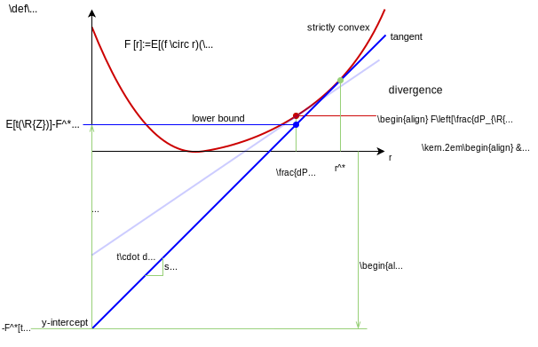

---
jupytext:
  text_representation:
    extension: .md
    format_name: myst
    format_version: 0.13
    jupytext_version: 1.10.3
kernelspec:
  display_name: Python 3 (ipykernel)
  language: python
  name: python3
---

+++ {"slideshow": {"slide_type": "slide"}, "tags": []}

# Extension of DV Formula

+++

$\def\abs#1{\left\lvert #1 \right\rvert}
\def\Set#1{\left\{ #1 \right\}}
\def\mc#1{\mathcal{#1}}
\def\M#1{\boldsymbol{#1}}
\def\R#1{\mathsf{#1}}
\def\RM#1{\boldsymbol{\mathsf{#1}}}
\def\op#1{\operatorname{#1}}
\def\E{\op{E}}
\def\d{\mathrm{\mathstrut d}}$

+++

## $f$-divergence

+++

Consider the more general problem of estimating the $f$-divergence in {eq}`f-D`:

$$
D_f(P_{\R{Z}}\|P_{\R{Z}'}) = E\left[f\left(\frac{dP_{\R{Z}}(\R{Z})}{dP_{\R{Z}'}(\R{Z})}\right)\right].
$$

+++

**Exercise** 

How to estimate $f$-divergence using the DV formula?

+++ {"nbgrader": {"grade": true, "grade_id": "DV-f-D", "locked": false, "points": 1, "schema_version": 3, "solution": true, "task": false}}

````{toggle}
**Solution**

Note that the neural network approximates the density ratio {eq}`dP-ratio`, 

$$
t \approx \frac{dP_{\R{Z}}}{dP_{\R{Z}'}},
$$

which can then be used to evaluate the sample average {eq}`avg-f-D`,

$$
D_f(P_{\R{Z}}\| P_{\R{Z}'}) \approx \frac{1}{n} \sum_{i\in [n]} f\left(t(\R{Z})\right).
$$

````

+++

Instead of using the DV bound, it is desirable to train a network to optimize a tight bound on the $f$-divergence because:

+++

- *Estimating KL divergence well does not imply the underlying neural network approximates the density ratio well*:  
  - While KL divergence is just a non-negative real number, 
  - the density ratio is in a high dimensional function space.

+++

- DV formula does not directly maximizes a bound on $f$-divergence, i.e.  
  it does not directly minimize the error in estimating $f$-divergence.

+++

- $f$-divergence may have bounds that are easier/more stable for training a neural network.

+++

**How to extend the DV formula to $f$-divergence?**

+++

The idea is to think of the $f$-divergence as a convex *function(al)* evaluated at the density ratio:

+++

````{prf:proposition}  
:label: D->F

$f$-divergence {eq}`f-D` is

$$
\begin{align}
D_f(P_{\R{Z}}\|P_{\R{Z}'}) = F\left[ \frac{P_{\R{Z}}}{P_{\R{Z}'}}\right]
\end{align}
$$ (D->F)

where 

$$
\begin{align}
F[r] := E [ \underbrace{(f \circ r)(\R{Z}')}_{f(r(\R{Z}'))}]
\end{align}
$$ (F)

for any function $r:\mc{Z} \to \mathbb{R}$.

````

+++

This is more like a re-definition than a proposition as the proof is immediate:  
{eq}`f-D` is obtained from {eq}`D->F` by substituting $r=\frac{dP_{\R{Z}}}{dP_{\R{Z}'}}$.

+++

As mentioned before, the KL divergence $D(P_{\R{Z}}\|P_{\R{Z}'})$ is a special case of $f$-divergence:

$$
D(P_{\R{Z}}\|P_{\R{Z}'}) = F\left[r\right]
$$ 

where

$$
\begin{align*}
F[r] &:= E\left[ r(\R{Z}')\log r(\R{Z}')\right].
\end{align*}
$$ (KL:F)

+++

**Exercise** When is $F[r]=0$ equal to $0$?

+++ {"nbgrader": {"grade": true, "grade_id": "zero-F", "locked": false, "points": 1, "schema_version": 3, "solution": true, "task": false}}

````{toggle}
**Solution** 

$F[r]=0$ iff $f(r(\R{Z}'))=0$ almost surely, which happens iff $r(\R{Z}')=1$ almost surely. We may also write it more explicitly as:

$$
r(z) = z \qquad \forall z\in \op{supp}(p_{\R{Z}'}):= \Set{z\in \mc{Z}\mid p_{\R{Z}'}(z) > 0},
$$

namely an identity function over the support set of $\R{Z}'$.

````

+++

**Exercise** 

Show using the properties of $f$ that $F$ is strictly convex.

+++

````{toggle}
**Solution**

For $\lambda\in [0,1]$ and functions $r_1, r_2\in \Set{r:\mc{Z}\to \mathbb{R}}$,

$$
\begin{align*}
F[\lambda r_1 + (1-\lambda) r_2] 
&= E[\underbrace{ f(\lambda r_1(\R{Z}') + (1-\lambda) r_2(\R{Z}'))}_{\stackrel{\text{(a)}}{\geq} \lambda f(r_1(\R{Z}'))+(1-\lambda) f(r_2(\R{Z}'))}]\\
&\stackrel{\text{(b)}}{\geq} \lambda E[f(r_1(\R{Z}'))] + (1-\lambda) E[f(r_2(\R{Z}'))]
\end{align*}
$$

where (a) is by the convexity of $f$, and (b) is by the linearity of expectation. $F$ is strictly convex because (b) is satisfied with equality iff (a) is almost surely.

````

+++

For a clearer understanding, let consider a different choice of $F$ for the KL divergence:

$$
D(P_{\R{Z}}\|P_{\R{Z}'}) = F'\left[r\right]
$$ 

where

$$
\begin{align*}
F'[r] &:= E\left[ \log r(\R{Z})\right].
\end{align*}
$$ (rev-KL:F)

+++

Note that $F'$ in {eq}`rev-KL:F` defined above is concave in $r$. In other words, {eq}`D2` in {prf:ref}`DV2`

$$
\begin{align*}
D(P_{\R{Z}}\|P_{\R{Z}'}) & =  \sup_{\substack{r:\mc{Z}\to \mathbb{R}_+\\ E[r(\R{Z}')]=1}} E \left[ \log r(\R{Z}) \right] 
\end{align*}
$$

is maximizing a concave function and therefore has a unique solution, namely, $r=\frac{dP_{\R{Z}}}{dP_{\R{Z}'}}$. Here comes the tricky question:

+++

**Exercise**

Is KL divergence concave or convex in the density ratio $\frac{dP_{\R{Z}}}{dP_{\R{Z}'}}$? Note that $F$ defined in {eq}`KL:F` is convex in $r$.

+++ {"nbgrader": {"grade": true, "grade_id": "rev-KL", "locked": false, "points": 1, "schema_version": 3, "solution": true, "task": false}}

````{toggle}
**Solution**

The statement is invalid because KL divergence is not purely a function of the density ratio, but both $P_{\R{Z}}$ and $P_{\R{Z}'}$. The expectation in {eq}`rev-KL:F`, in particular, depends on $P_{\R{Z}}$.

````

+++

## Convex conjugation

+++

Given $P_{\R{Z}'}\in \mc{P}(\mc{Z})$, consider 
- a function space $\mc{R}$, 

$$
\begin{align}
\mc{R} &\supseteq \Set{r:\mathcal{Z}\to \mathbb{R}_+\mid E\left[r(\R{Z}')\right] = 1},
\end{align}
$$ (R)

- a dual space $\mc{T}$, and 

$$
\begin{align}
\mc{T} &\supseteq \Set{t:\mc{Z} \to \mathbb{R}}
\end{align}
$$ (T)

- the corresponding inner product $\langle\cdot,\cdot \rangle$:

$$
\begin{align}
\langle t,r \rangle &= \int_{z\in \mc{Z}} t(z) r(z) dP_{\R{Z}'}(z) = E\left[ t(\R{Z}') r(\R{Z}') \right].
\end{align}
$$ (inner-prod)

+++

The following is a generalization of DV formula for estimating $f$-divergence {cite}`nguyen2010estimating`{cite}`ruderman2012tighter`:

+++

````{prf:proposition}  
:label: convex-conjugate

$$
\begin{align}
D_{f}(P_{\R{Z}} \| P_{\R{Z}'}) = \sup _{t\in \mc{T}} E[g(\R{Z})] - F^*[t],
\end{align} 
$$ (convex-conjugate2)

where 

$$
\begin{align}
F^*[t] = \sup_{r\in \mc{R}} E[t(\R{Z}') r(\R{Z}')] - F[r].
\end{align}
$$ (convex-conjugate1)

````

+++

````{prf:proof}

Note that the supremums in {eq}`convex-conjugate1` and {eq}`convex-conjugate2` are [Fenchel-Legendre transforms][FL]. Denoting the transform as $[\cdot]^*$,

$$\underbrace{[[F]^*]^*}_{=F}\left[\frac{dP_{\R{Z}}}{dP_{\R{Z}'}}\right]$$

which gives {eq}`convex-conjugate2` by expanding the outer/later transform. The equality is by the property that Fenchel-Legendre transform is its own inverse for strictly convex functional $F$.

[FL]: https://en.wikipedia.org/wiki/Convex_conjugate

````

+++

The proof is illustrated in the following figure:

+++



+++

Let's breakdown the details:

+++

**Step 1**

For the purpose of the illustration, visualize the convex functional $F$ simply as a curve in 2D.

  

The $f$-divergence is then the $y$-coordinate of a point on the curve indicated above, with $r$ being the density ratio $\frac{dP_{\R{Z}}}{dP_{\R{Z}'}}$.

+++

**Step 2**

To obtain a lower bound on $F$, consider any tangent of the curve with an arbitrary slope $t\cdot dP_{\R{Z}'}$


The lower bound is given by the $y$-coordinate of a point on the tangent with $r$ being the density ratio.

+++

**Exercise**

Why is the $y$-coordinate of the tangent a lower bound on the $f$-divergence?

+++

````{toggle}
**Solution**

By the convexity of $F$, the tangent must be below $F$.

````

+++

**Step 3**

To calculate the lower bound, denote the $y$-intercept as $-F^*[t]$:

  

Thinking of a function as nothing but a vector, the displacement from the $y$-intercept to the lower bound is given by the inner product of the slope and the density ratio. 

+++

**Step 4**

To make the bound tight, maximize the bound over the choice of the slope or $t$:

 

This gives the bound in {eq}`convex-conjugate2`. It remains to show {eq}`convex-conjugate1`.

+++

**Step 5**

To compute the $y$-intercept or $F^*[t]$, let $r^*$ be the value of $r$ where the tangent touches the convex curve:

 

The displacement from the point at $r^*$ to the $y$-intercept can be computed as the inner product of the slope and $r^*$.

+++

**Exercise**

Show that for the functional $F$ {eq}`KL:F` defined for KL divergence,

$$F^*[t]=\log E[e^{t(\R{Z}')}]$$

with $\mc{R}=\Set{r:\mc{Z}\to \mathbb{R}_+}$ and so {eq}`convex-conjugate2` gives the DV formula {eq}`DV` as a special case.

+++ {"nbgrader": {"grade": true, "grade_id": "f-D_KL", "locked": false, "points": 1, "schema_version": 3, "solution": true, "task": false}}

````{toggle}
**Solution**

See {cite}`ruderman2012tighter`.````


